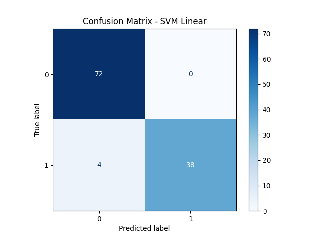

# 🧬 Task 7: SVM Classification – Breast Cancer Detection

## 📌 Objective
To build and evaluate multiple **Support Vector Machine (SVM)** classifiers to predict whether a tumor is **benign or malignant**, using the Breast Cancer Wisconsin dataset. The goal is to find the best-performing model using linear and RBF kernels, perform hyperparameter tuning, and visualize key insights.

---

## 🛠️ Tools & Libraries Used

- **Python**
- **Pandas**
- **NumPy**
- **Matplotlib**
- **Seaborn**
- **scikit-learn**

---

## 📁 Project Structure

| File/Folder                       | Description                                              |
|----------------------------------|----------------------------------------------------------|
| `breast-cancer.csv`              | Input dataset (Breast Cancer Wisconsin data)             |
| `svm_breast_cancer.py`           | Python script implementing and evaluating SVM models     |
| `outputs/`                       | Directory containing all generated visualizations        |
| `README.md`                      | Project documentation                                    |

---

## 🔍 Workflow Overview

1. **Loaded** and explored the dataset
2. **Preprocessed**:
   - Encoded diagnosis labels
   - Removed ID and null columns
   - Standardized features
3. **Split** data into training and testing sets (80-20)
4. Trained three **SVM models**:
   - Linear kernel
   - RBF kernel
   - RBF with GridSearchCV
5. **Evaluated** all models using:
   - Accuracy
   - Classification Report
   - Confusion Matrix
6. **Visualized**:
   - Class distribution
   - PCA decision boundaries
   - Model comparisons
   - Feature insights

---

## 📊 Evaluation Metrics

| Model             | Accuracy (example) |
|------------------|---------------------|
| **SVM Linear**    | ~ 0.964             |
| **SVM RBF**       | ~ 0.956             |
| **Tuned SVM RBF** | ~ 0.973 ✅ Best      |

All reports are printed to the console upon running the script.

---

## 📈 Visualizations

### 1. 📉 Accuracy Comparison
Compare model performance  


### 2. 📊 Confusion Matrices
Each model’s classification breakdown  
- SVM Linear:   
- SVM RBF:   
- Tuned SVM RBF: 

### 3. 🌈 PCA Decision Boundary
Visual boundary between classes (2D)  


### 4. 🧪 Class Distribution Pie Chart


### 5. 🧬 Feature Correlation Heatmap
Understand multicollinearity  


### 6. 🔗 Pairplot of Top Features
Best correlated with diagnosis  


### 7. 📦 Boxplot: Radius Mean by Diagnosis


### 8. 🎻 Violin Plot: Texture Mean


---

## ▶️ How to Run

```bash
pip install pandas numpy matplotlib seaborn scikit-learn
python svm_breast_cancer.py
